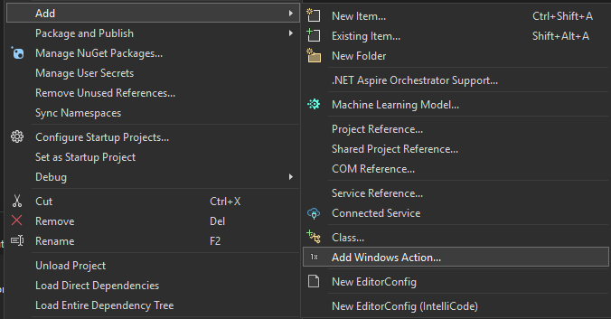

# Scenario 1: Build Actions
In this module, you'll explore how to build and test actions and how to use the VSIX and Code Generation APIs to make building actions easier. 

You will explore, deploy, and test the actions from a ToDoList sample app and then complete some challenges that have different difficulty levels for the remainder of the module.

By the end of this module, you will have learned how to: 
-  Register and define an action
-  Deploy and test the action
-  Create your own action. 

## Explore the ToDoList app
Navigate to the [ToDoList app](https://github.com/microsoft/Lab370/tree/main/Scenario%201/ToDoList) in the repo you just cloned. In Visual Studio navigate to  **Scenario1/TodoList**

Let's explore the specific files in the ToDoList solution that are needed to build actions. 
- **Assets/registration.json**: This file is needed to define the action metadata e.g its inputs, outputs and how to call it. You'll see an action called 'AddToList' is defined and takes a single text string as input and returns a text response as output. Its invocation type is COM. The other option would be to use URI.
- **Package.appxmanifest**: The package Manifest is where you register your action by providing a path to the action registration JSON file.
- **ToDoActionHandler.cs**: This file contains the code to handle the input text the action receives from the user and post the to-do item to the UI.

## Deploy ToDoList app
In Visual Studio, build and deploy the ToDoList application.

## Test the action
1) Open the App Actions Testing Playground and create a new text entity by clicking  the "Add an entity" button.
2) Run the **ToDoList.ToDoActionHandler.AddToList** action on your new text entity.
3) You should see the text you entered appear in your todo list in the app like the image below. 


Now that you have an understanding of what is needed to build an action, choose some of the challenges below to deepen your understanding. You may choose to do one or all of the challenges. 

Stop debugging the ToDoList app by hitting Shift + F5 to get ready for the next challenge.

## CHALLENGE 1.1: Create a WHERE clause 
In some cases, you might want to limit your action input to specific entities. You can do this using `where` clauses. 

A where clause is a condition that is evaluated to determine whether an action is applicable to a set of input entities, based on the entities' properties.
- Can be zero or more where clauses
- They are evaluated in the order they are specified
- All where clauses must evaluate to true for the action to be applicable.

If you'd like to learn more, [use this link to developer documentation](https://learn.microsoft.com/en-us/windows/apps/develop/actions/action-json#where-clauses).

1) Open **ToDoActionHandler.cs**. 
2) Modify the existing `WindowsActionInputCombination` attribute to include the `Where` property. For example:
   ```cs
   [WindowsActionInputCombination(
       Inputs = ["todo"],
       Description = "Add '${todo.ShortText}' to your to-do list.",
       Where = ["${todo.Length} < 20"])]
   ```
   This limits the acceptable input text length to less than 20.
3) Use the [table below](#text-entity-properties) to pick  text entity properties that you would like to apply a where condition on.
4) Run the ToDoList app with this change.
5) For your update to be picked up, you need to uninstall and install ToDoList app. You can do this by finding the ToDoList app in Start menu and uninstalling it. Or you can run this command in PowerShell.
```
Remove-AppxPackage -Package 'ToDoListSample_1.0.0.0_x64__cw5n1h2txyewy'
```
6) Launch the App Actions Testing Playground and create two text entities, one that is less than 20 characters and one that is more than 20 characters.
7) Launch your **'AddToList'** action and run it on both test entities you created. You should see your action succeed with entities that meet your condition, and error messages when the entity does not meet the condition.


    ### Text Entity Properties
    | Property  | Type |  Description    |
    |-------|-----|-------|
    | Text | String   | The full text |
    | TextFormat   | ActionEntityTextFormat  | The format of the text   |
    | ShortText | String | A shortened version of the text, suitable for UI display |
    | Title | String | The title of the text |
    | Description | String | A description of the text | 
    | Length | Double | The length of the text in charachters |
    | WordCount | Double | The number of words in the text | 

## CHALLENGE 1.2: Create an action from a new project
This challenge will walk you through creating an action from a new WinUI project. 

Follow these steps to create your Action project:
  1) Open the create a new project dialog and select a blank packaged WinUI 3 in desktop application project. 
  2) Select Next.
  3) Name the project whatever you would like.
  4) Select Create.
  5) Ensure the Target Framework is set to `net8.0-windows10.0.26100.0`  by double-clicking on the project in Solution Explorer.
  6) Install the NuGet package. 
      - Right click on the project in Solution Explorer
      - Select Manage NuGet Packages 
      - Select or create C:/LocalNuget as your package source
      - Mark the checkbox 'include prerelease' 
      - Install Microsoft.AI.Actions.Annotations.
  7) Right click on the app project and navigate to the "Add Windows Action" item in the context menu and select it. 

  
    
The VSIX will create a registration.json file and **WindowsActionHandler.cs** file with a simple SendMessage text action defined. The action will show a message to the user when invoked. Let's deploy the app and open the test.

1) Run the sample project by selecting F5 to deploy your app. You should see a blank app with a button that says **Click Me**.
2) Open the App Actions Playground Test Tool and locate your app's actions in the list of available actions.
3) Select your action. A dialog will appear to select the entities that your action will take as an input.
4) Select the **Markdown Text** option.
5) Click the **Run Action** button.
6) Validate that the action appears. The action always returns "Hello World".


## CHALLENGE 1.3: Create your own action
Now it's your turn to create an action! 

As an example, imagine you are building a feature that could be used in a microblog app (you will see this in the next Lab section). For example, You could build a like meme-creation feature that returns an image based on text input, or a quote generator which gets relevant quotes for your post, or one that can rewrite your post in different tones or summarize a long post. We have a simple PigLatin sample that you could work with here. `Scenario1\PigLatinApp`.

### Text Entity Properties
| Property  | Type |  Description    |
|-------|-----|-------|
| Text | String   | The full text |
| TextFormat   | ActionEntityTextFormat  | The format of the text   (Plain or Markdown)|
| ShortText | String | A shortened version of the text, suitable for UI display |
| Title | String | The title of the text |
| Description | String | A description of the text | 
| Length | Double | The length of the text in charachters |
| WordCount | Double | The number of words in the text | 

### Photo Entity Properties
| Property  | Type |  Description    |
|-------|-----|-------|
| FileName | String   | The name of the file |
| Path   | String | The path of the file  |
| Extension | String | The extension of the file |
| IsTemporaryPath | Boolean   | Whether the photo is stored in a temporary path, for example the Photo was created from a bitmap, not a file path.  |

Photo is a subclass of the File entity type which has these properties.

#### File Entity Properties
| Property  | Type |  Description    |
|-------|-----|-------|
| FileName | String   | The name of the file |
| Path   | String | The path of the file  |
| Extension | String | The extension of the file |

In the next module, you will learn how to [consume actions](./4-consume-actions.md)
