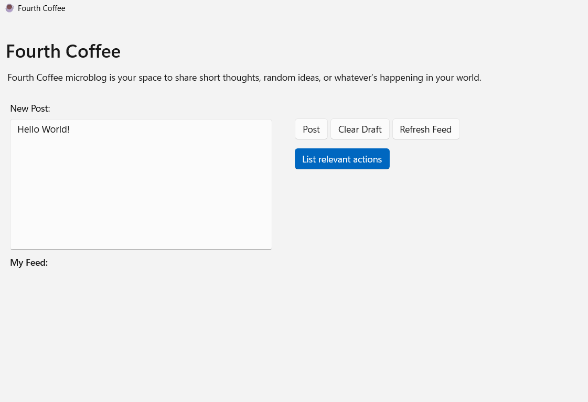
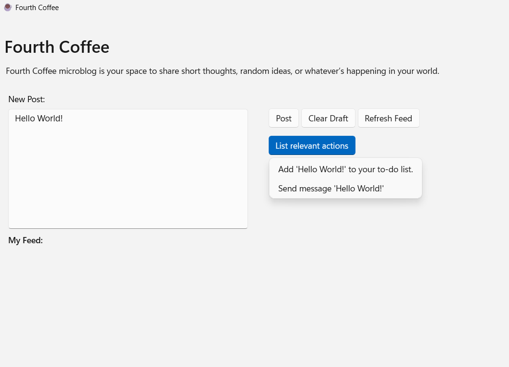

# Consuming Actions
Now that you have had some practice creating actions. Let's walk through how to update an existing app to consume actions. 

The sample app that you will work with is an app that only integrates actions that are available for text. The actions will also be displayed in alphabetical order so the users can expect the actions to appear in the same order every time they are invoked from the app. In this module, please complete all challenges. 

By the end of this module you will be able to: 
- Understand how to update an existing app to consume actions.
- Deepen your understanding by learning how to filter and sort the actions displayed to the end user. 

## Open and run the sample app
1) Navigate to the **Scenario 2** folder in Visual Studio. 

2) Open the ActionConsumerSampleApp.sln

3) Deploy the app by selecting F5 and ensure that the application runs. You should see an app like the image below



When you enter text into the 'New Post' text box and click 'List relevant actions', there are no available actions.

## CHALLENGE 2.1: Update the app to consume actions. 

Now let's update this app to display relevant text actions available on the user's device.

1) Navigate to `Scenario 2\ActionConsumerSampleApp\MainWindow.xaml.cs` in Visual Studio

2) In `MainWindow.xaml.cs`, search for the comment `// Return the the actions that are available for the specified file entity type` and uncomment the line below it. Delete the line commented with `// PLACEHOLDER CODE`.
```cs
// Return the the actions that are available for the specified file entity type
Windows.AI.Actions.Hosting.ActionInstance[] actionInstantiations = ActionManager.Instance.ActionRuntime.ActionCatalog.GetActionsForInputs(inputs.ToArray());
```

This code will return the actions that are available for the specified file entity type. It will evaluate the overloads where clauses and return only the actions that match.

2) In `MainWindow.xaml.cs`, search for the comment `// Alphabetize the list of returned actions` and uncomment the line below it. Delete the line commented with `// PLACEHOLDER CODE`. This code will order the returned results in alphabetical order.
```cs
// Alphabetize the list of returned actions
List<Windows.AI.Actions.Hosting.ActionInstance> sortedList = actionInstantiations.OrderBy(obj => obj.DisplayInfo.Description).ToList();
```

3) Deploy the app by selecting F5.

4) Enter any text in the 'New Post' textbox.

5) Select the `List relevant actions` button to reveal the context menu with the available actions for text entities. You should see a to-do list and send message action.
  
7) Invoke the actions and see what you can do!



## CHALLENGE: 2.2 Return a specific action
Not all these actions are appropriate for this mciroblog. You may want to specify which actions your users waht to interact with by selecting specific desired actions.

1) In `MainWindow.xaml.cs`, find the comment: `// CHALLENGE: Filter the list further to only return a specific action`. 

2) Reference the following example to filter `sortedList` to return the action you created in Challenge 1.3. Here we've pointed to the 'Rewrite in Piglatin' action.

```cs
sortedList = actionInstantiations.Where(actions => actions.Definition.Id == "PigLatinApp.WindowsActionHandler.RewriteInPiglatin").ToList();
```


[Next Steps](./5-congrats.md)

